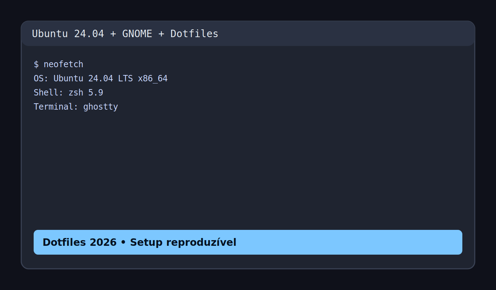
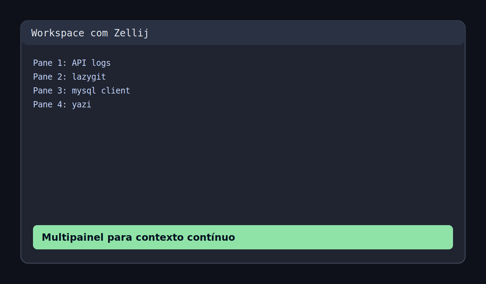
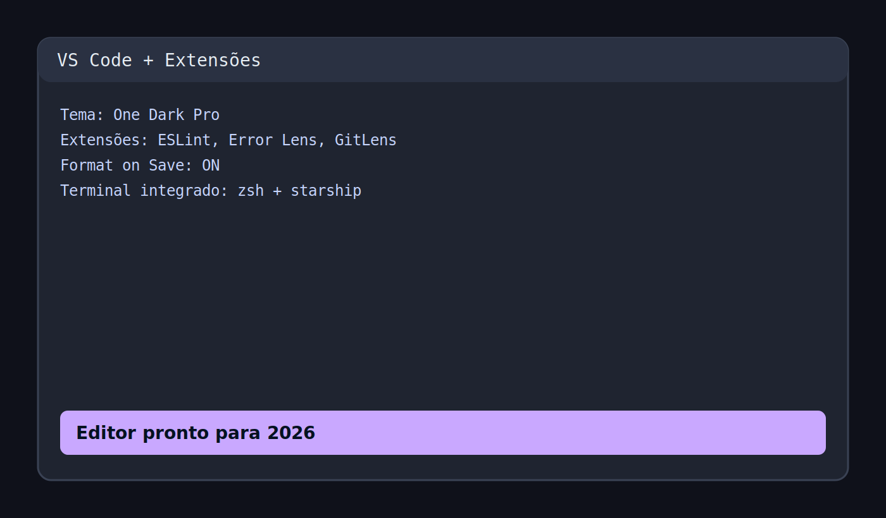

# ⚡ Dotfiles 2026 Edition

> Setup pessoal para transformar uma instalação limpa de Ubuntu em um ambiente de desenvolvimento moderno, rápido e reproduzível.

## 🧠 O que mudou para 2026

- **Novo instalador orientado por perfil** com suporte a `--dry-run` (`setup-2026.sh`).
- **Fluxo modular** reaproveitando os scripts já existentes em `programas/*/setup.sh`.
- **Documentação reorganizada** com foco em onboarding rápido e visão de stack.
- **Galeria de prints** para visualizar o setup antes de instalar.

## 🚀 Começando em 2 minutos

```bash
git clone https://github.com/juninmd/dotfiles.git
cd dotfiles
chmod +x setup-2026.sh
./setup-2026.sh --profile dev
```

### Perfis disponíveis

- `minimal`: shell moderna + prompt + VS Code.
- `dev`: perfil recomendado (minimal + runtimes, Docker, banco e produtividade).
- `full`: mesma base do `dev`, pensado para expandir com módulos extras.

### Simular sem instalar nada

```bash
./setup-2026.sh --profile dev --dry-run
```

## 🖼️ Prints do sistema (versão 2026)

### 1) Visão geral do desktop


### 2) Terminal com tooling moderna


### 3) Workspace com Zellij


### 4) VS Code pronto para produtividade


## 🧩 Componentes do repositório

- **Sistema operacional**
  - Ubuntu: [`so/ubuntu/readme.md`](./so/ubuntu/readme.md)
  - Windows: [`so/windows/readme.md`](./so/windows/readme.md)
- **Programas e ferramentas**
  - VS Code: [`programas/vscode/readme.md`](./programas/vscode/readme.md)
  - Zsh: [`programas/zsh/readme.md`](./programas/zsh/readme.md)
  - Starship: [`programas/starship/starship.toml`](./programas/starship/starship.toml)
  - MySQL: [`programas/mysql/readme.md`](./programas/mysql/readme.md)
  - Android: [`programas/android/readme.md`](./programas/android/readme.md)
  - Firefox: [`programas/firefox/readme.md`](./programas/firefox/readme.md)

## 🛠️ Utilitários

- Gerar chave SSH: [`utils/generate-ssh.sh`](./utils/generate-ssh.sh)
- Scripts de setup por programa: [`programas`](./programas)
- Ferramentas extras: [`tools/readme.md`](./tools/readme.md)

## 📌 Roadmap rápido

- [ ] Adicionar perfil `workstation` com foco em desktop + design.
- [ ] Exportar snapshots automáticos de configurações sensíveis.
- [ ] Adicionar CI para validar shell scripts com `shellcheck`.
- [ ] Criar script de rollback para remover módulos instalados.

## 🙌 Créditos

- Base original inspirada em: <https://github.com/shubhampathak/autosetup>
